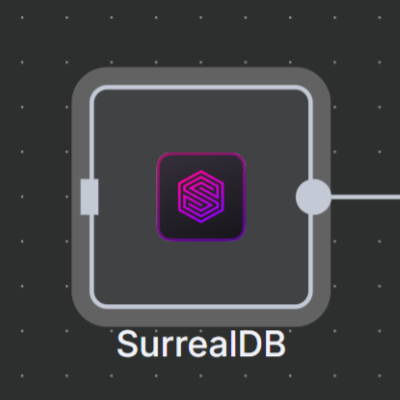
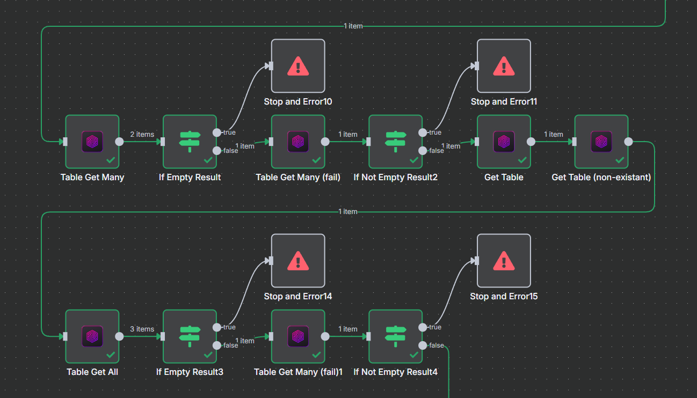

<p align="center">
    
</p>

<p align="center">
    <a href="LICENSE"></a>
    <a href="https://www.npmjs.com/package/n8n-nodes-surrealdb"></a>
    <a href="https://github.com/nsxdavid/n8n-nodes-surrealdb/releases"></a>
</p>


# n8n-nodes-surrealdb

This is an n8n community node for SurrealDB. It provides both action and tool nodes to interact with a SurrealDB database, allowing you to create, read, update, and delete records, as well as execute custom SurrealQL queries.

<p align="center">
  
</p>

[n8n](https://n8n.io/) is a [fair-code licensed](https://docs.n8n.io/reference/license/) workflow automation platform.

## Table of Contents

- [Important Notes](#important-notes)
- [Features](#features)
- [Installation](#installation)
- [Configuration](#configuration)
- [Operations](#operations)
- [Understanding SurrealDB and n8n Integration](#understanding-surrealdb-and-n8n-integration)
- [Resources](#resources)
- [Development](#development)
- [Contributing](#contributing)
- [License](#license)

## Important Notes

- **Self-Hosted Only**: As with all community nodes, this node works only with self-hosted n8n instances, not with n8n Cloud.
- **HTTP/HTTPS Only**: Due to n8n's architecture, this node only supports HTTP/HTTPS connections to SurrealDB. WebSocket connections (WS/WSS) are not supported.
- **Tool Node Support**: To use this node as a tool in AI workflows, you must set the environment variable `N8N_COMMUNITY_PACKAGES_ALLOW_TOOL_USAGE=true`.

## Features

- **Dual Node Types**: Functions as both an action node and a tool node for AI workflows
- **Complete CRUD Operations**: Create, read, update, and delete SurrealDB records
- **Custom Queries**: Execute any SurrealQL query with full parameter support
- **Table Operations**: List fields and explore table structure
- **Relationship Support**: Query and manage record relationships
- **Native Data Format**: Works with SurrealDB's native data formats

## Installation

### Prerequisites

1. You need a self-hosted n8n instance (v0.214.0 or later recommended)
2. You need access to a SurrealDB instance (v1.0.0 or later recommended)

### Installation Steps

1. Open your n8n instance
2. Go to **Settings** > **Community Nodes**
3. Click **Install**
4. Enter `n8n-nodes-surrealdb` and click **Install**
5. Restart your n8n instance if prompted

## Configuration

### Credentials

To use the SurrealDB node, you need to create credentials with the following properties:

* **Connection String** - The connection string to your SurrealDB instance (must start with http:// or https://). WebSocket connections (ws:// or wss://) are not supported.
* **Authentication** - Choose the authentication scope:
  * **Root** - Full access to all namespaces and databases
  * **Namespace** - Access limited to a specific namespace
  * **Database** - Access limited to a specific database within a namespace
* **Username** - Username for authentication
* **Password** - Password for authentication
* **Namespace** - Target namespace (required for Namespace and Database authentication)
* **Database** - Target database (required for Database authentication)

#### Authentication Types and Namespace/Database Handling

The authentication type you choose affects how namespace and database information is handled:

1. **Root Authentication**:
   * Provides access to all namespaces and databases
   * Namespace and Database fields in credentials are optional
   * You can override namespace/database at the node level for each operation

2. **Namespace Authentication**:
   * Provides access to all databases within a specific namespace
   * Namespace field in credentials is required
   * Database field in credentials is optional
   * You can override the database at the node level for each operation

3. **Database Authentication**:
   * Provides access to a specific database within a specific namespace
   * Both Namespace and Database fields in credentials are required
   * You can still override these at the node level for specific operations

#### Node-Level Namespace and Database Overrides

For most operations, you can override the namespace and database settings from your credentials:

1. In the node configuration, expand the **Options** section
2. Enter values in the **Namespace** and/or **Database** fields
3. These values will take precedence over the credential settings for that specific operation
4. You will be required to provide a namespace when using Namespace authentication
5. You will be required to provide both a namespace and database when using Database authentication

## Operations

The SurrealDB node provides a fairly comprehensive set of operations organized by resource type. For most anything not covered, you can use the Execute Query operation.

### Record Operations

* **Create Record** - Create a single record in a table
* **Get Record** - Retrieve a specific record by ID
* **Update Record** - Update a specific record by ID
* **Upsert Record** - Create or update a record (insert if not exists, update if exists)
* **Delete Record** - Delete a specific record by ID

### Table Operations

* **Get All Records** - Retrieve all records from a table
* **Create Many** - Create multiple records in a table
* **Get Many** - Retrieve multiple records by IDs
* **Update All Records** - Update all records in a table
* **Delete All Records** - Delete all records from a table
* **Merge All Records** - Merge the same data into all records in a table
* **Create Table** - Define a new table with optional schema
* **Delete Table** - Remove a table from the database
* **Get Table** - Retrieve information about a table

### Field Operations

* **List Fields** - List all fields defined on a table
* **Create Field** - Create a new field on a table
* **Delete Field** - Delete a field from a table

### Index Operations

* **Create Index** - Create a new index on a table
* **Delete Index** - Delete an index from a table

### Relationship Operations

* **Create Relationship** - Create a relationship between two records
* **Delete Relationship** - Delete a relationship between records
* **Query Relationships** - Query relationships between records

### Query Operations

* **Execute Query** - Execute a raw SurrealQL query with parameters

### System Operations

* **Health Check** - Check if the database instance is responsive
* **Version** - Get the version of the SurrealDB instance

## Understanding SurrealDB and n8n Integration

### Connection Protocol Limitation

**Important**: Due to n8n's architecture, this node only supports HTTP/HTTPS connections to SurrealDB. WebSocket connections (WS/WSS) are not supported.

- Your connection string must start with `http://` or `https://` (not `ws://` or `wss://`)
- When configuring your SurrealDB instance, ensure it's accessible via HTTP/HTTPS
- If you're using SurrealDB Cloud or another instance that only offers WebSocket connections, you'll need to set up a self-hosted SurrealDB instance with HTTP enabled
- This limitation is due to how n8n handles connections and executes node operations

#### SurrealDB HTTP vs WebSocket

SurrealDB supports both HTTP and WebSocket protocols:

- **HTTP/HTTPS**: Used for stateless connections, ideal for individual queries
- **WebSocket (WS/WSS)**: Used for stateful connections, better for real-time applications

This node uses the HTTP/HTTPS protocol exclusively, which means:

1. Each operation creates a new connection to SurrealDB
2. The connection is closed after the operation completes
3. No persistent connection is maintained between operations

### SurrealDB Result Handling

SurrealDB operations often return empty results rather than errors when no matching data is found. This behavior differs from many other databases and can be important to understand when building workflows:

- **Empty Results vs. Errors**: A query for a non-existent record returns an empty result, not an error
- **Always Output Data**: The "Always Output Data" option is particularly useful with SurrealDB to ensure your workflow continues even when no results are found

### Working with SurrealDB Data Types

SurrealDB supports rich data types that map well to n8n's JSON handling:

- **Records and IDs**: SurrealDB record IDs use the format `table:id`
- **Relationships**: Relationships are first-class citizens in SurrealDB
- **Arrays and Objects**: Nested data structures are fully supported


## Compatibility

This node has been tested with SurrealDB v2.x.

## Resources

* [n8n Community Nodes Documentation](https://docs.n8n.io/integrations/community-nodes/)
* [SurrealDB Documentation](https://surrealdb.com/docs)
* [SurrealQL Reference](https://surrealdb.com/docs/surrealql)

## Development

If you want to contribute to this node:

1. Clone the repository
2. Install dependencies: `npm install`
3. Build the node: `npm run build`
4. Link to your n8n installation for testing: `npm link`
5. In your n8n installation directory: `npm link n8n-nodes-surrealdb`

### Debug Mode

The node includes a centralized debug system that can be enabled via environment variable:

```bash
# Enable debug logging
export SURREAL_DEBUG=true

# Or set to '1' to enable
export SURREAL_DEBUG=1

# Disable debug logging (default)
export SURREAL_DEBUG=false
```

When debug mode is enabled, the node will output detailed logging information including:
- Operation execution details
- Query preparation and execution
- Parameter validation
- Error handling details

This is particularly useful for:
- Troubleshooting connection issues
- Understanding query execution
- Debugging parameter handling
- Development and testing

The debug system is centralized in `src/nodes/SurrealDb/debug.ts` and automatically respects the environment variable setting.

## Contributing

Contributions are welcome! Please feel free to submit a Pull Request.

1. Fork the repository
2. Create your feature branch: `git checkout -b feature/amazing-feature`
3. Commit your changes: `git commit -m 'Add some amazing feature'`
4. Push to the branch: `git push origin feature/amazing-feature`
5. Open a Pull Request

## License

This project is licensed under the MIT License - see the [LICENSE](LICENSE) file for details.
