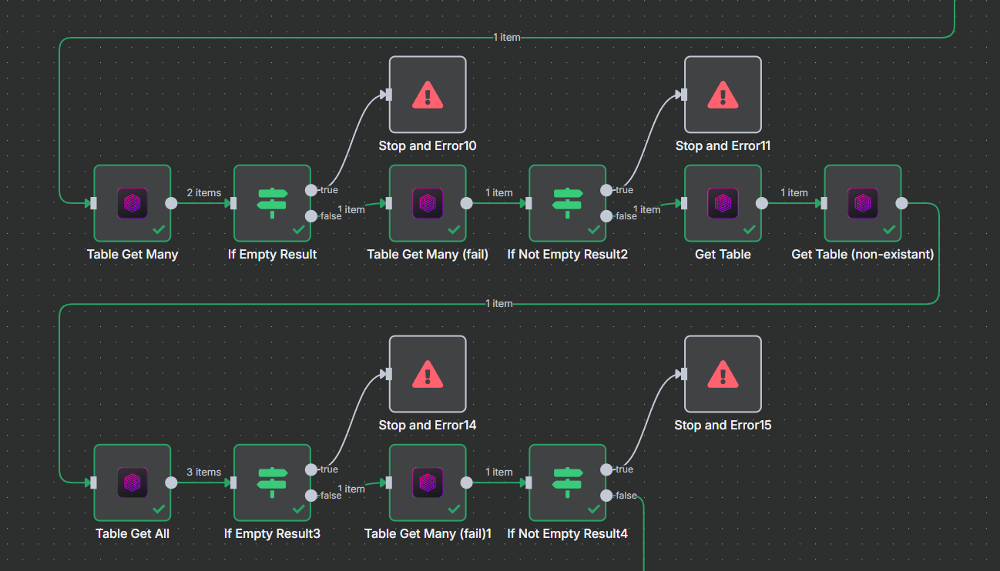

<br>

<p align="center">
    
    &nbsp;
    
</p>

<h3 align="center">The official n8n node for SurrealDB.</h3>

<br>

<p align="center">
    <a href="https://github.com/surrealdb/surrealdb.js"></a>
    &nbsp;
    <a href="https://surrealdb.com/docs/integrations/data-management/n8n"></a>
    &nbsp;
    <a href="https://www.npmjs.com/package/@surrealdb/n8n-nodes-surrealdb"></a>
    &nbsp;
    <a href="https://www.npmjs.com/package/@surrealdb/n8n-nodes-surrealdb"></a>
    &nbsp;
    <a href="https://github.com/surrealdb/n8n-nodes-surrealdb/blob/main/LICENSE"></a>
</p>

<p align="center">
    <a href="https://surrealdb.com/discord"></a>
    &nbsp;
    <a href="https://twitter.com/surrealdb"></a>
    &nbsp;
    <a href="https://www.linkedin.com/company/surrealdb/"></a>
    &nbsp;
    <a href="https://www.youtube.com/@SurrealDB"></a>
</p>

# n8n-nodes-surrealdb

The official n8n node package for SurrealDB. It provides two nodes:

- **SurrealDB**: interact with a SurrealDB database: create, read, update, and delete records, plus execute custom SurrealQL queries.
- **Spectron**: drive the [Spectron](https://surrealdb.com/platform/spectron) API from your n8n workflows: memory (remember/recall/chat), documents, entities, sessions, traces, and governance. See [Spectron](#spectron).

Both nodes can be used as action nodes and as tool nodes for AI workflows.

[n8n](https://n8n.io/) is a [fair-code licensed](https://docs.n8n.io/reference/license/) workflow automation platform.

<p align="center">
  
</p>

## Documentation

View the node documentation [here](https://surrealdb.com/docs/integrations/data-management/n8n).

## Learn SurrealDB

- SurrealDB University: https://surrealdb.com/learn/fundamentals
- Aeon's Surreal Renaissance (Interative book): https://surrealdb.com/learn/book
- Documentation: https://surrealdb.com/docs

## Table of Contents

- [Important Notes](#important-notes)
- [Features](#features)
- [Installation](#installation)
- [Configuration](#configuration)
- [Operations](#operations)
- [Spectron](#spectron)
- [Error Handling](#error-handling)
- [Understanding SurrealDB and n8n Integration](#understanding-surrealdb-and-n8n-integration)
- [Resources](#resources)
- [Development](#development)
- [Contributing](#contributing)
- [License](#license)

## Important Notes

- **Self-Hosted Only**: As with all community nodes, this node works only with self-hosted n8n instances, not with n8n Cloud.
- **HTTP/HTTPS Only**: Due to n8n's architecture, this node only supports HTTP/HTTPS connections to SurrealDB. WebSocket connections (WS/WSS) are not supported.
- **Tool Node Support**: To use this node as a tool in AI workflows, you must set the environment variable `N8N_COMMUNITY_PACKAGES_ALLOW_TOOL_USAGE=true`.

## Features

- **Dual Node Types**: Functions as both an action node and a tool node for AI workflows
- **Complete CRUD Operations**: Create, read, update, and delete SurrealDB records
- **Custom Queries**: Execute any SurrealQL query with full parameter support
- **Enhanced Query Builder**: Visual interface for building SELECT queries with WHERE, ORDER BY, GROUP BY, and other clauses
- **Table Operations**: List fields and explore table structure
- **Relationship Support**: Query and manage record relationships
- **Native Data Format**: Works with SurrealDB's native data formats
- **Connection Pooling**: Configurable connection pooling for improved performance and resource management
- **Enhanced Error Handling**: Comprehensive error classification, automatic retry logic, and connection recovery
- **Intelligent Recovery**: Different error handling strategies for different operation types
- **Detailed Error Reporting**: Rich error context with categorization and severity levels
- **Pool Monitoring**: Built-in pool statistics and performance monitoring

## Installation

### Prerequisites

1. You need a self-hosted n8n instance (v0.214.0 or later recommended)
2. You need access to a SurrealDB instance (v1.0.0 or later recommended)

### Installation Steps

1. Open your n8n instance
2. Go to **Settings** > **Community Nodes**
3. Click **Install**
4. Enter `@surrealdb/n8n-nodes-surrealdb` and click **Install**
5. Restart your n8n instance if prompted

## Configuration

### Credentials

To use the SurrealDB node, you need to create credentials with the following properties:

* **Connection String** - The connection string to your SurrealDB instance (must start with `http://` or `https://`). WebSocket connections (`ws://` or `wss://`) are not supported.
* **Authentication** - Choose the authentication scope:
  * **Root** - Full access to all namespaces and databases
  * **Namespace** - Access limited to a specific namespace
  * **Database** - Access limited to a specific database within a namespace
* **Username** - Username for authentication
* **Password** - Password for authentication
* **Namespace** - Target namespace (required for Namespace and Database authentication)
* **Database** - Target database (required for Database authentication)

#### Authentication Types and Namespace/Database Handling

The authentication type you choose affects how namespace and database information is handled:

1. **Root Authentication**:
   * Provides access to all namespaces and databases
   * Namespace and Database fields in credentials are optional
   * You can override namespace/database at the node level for each operation

2. **Namespace Authentication**:
   * Provides access to all databases within a specific namespace
   * Namespace field in credentials is required
   * Database field in credentials is optional
   * You can override the database at the node level for each operation

3. **Database Authentication**:
   * Provides access to a specific database within a specific namespace
   * Both Namespace and Database fields in credentials are required
   * You can still override these at the node level for specific operations

#### Node-Level Namespace and Database Overrides

For most operations, you can override the namespace and database settings from your credentials:

1. In the node configuration, expand the **Options** section
2. Enter values in the **Namespace** and/or **Database** fields
3. These values will take precedence over the credential settings for that specific operation
4. You will be required to provide a namespace when using Namespace authentication
5. You will be required to provide both a namespace and database when using Database authentication

## Operations

The SurrealDB node provides a fairly comprehensive set of operations organized by resource type. For most anything not covered, you can use the Execute Query operation.

### Record Operations

* **Create Record** - Create a single record in a table
* **Get Record** - Retrieve a specific record by ID
* **Update Record** - Update a specific record by ID
* **Upsert Record** - Create or update a record (insert if not exists, update if exists)
* **Delete Record** - Delete a specific record by ID

### Table Operations

* **Get All Records** - Retrieve all records from a table
* **Create Many** - Create multiple records in a table
* **Get Many** - Retrieve multiple records by IDs
* **Update All Records** - Update all records in a table
* **Delete All Records** - Delete all records from a table
* **Merge All Records** - Merge the same data into all records in a table
* **Create Table** - Define a new table with optional schema
* **Delete Table** - Remove a table from the database
* **Get Table** - Retrieve information about a table

### Field Operations

* **List Fields** - List all fields defined on a table
* **Create Field** - Create a new field on a table
* **Delete Field** - Delete a field from a table

### Index Operations

* **Create Index** - Create a new index on a table
* **Delete Index** - Delete an index from a table

### Relationship Operations

* **Create Relationship** - Create a relationship between two records
* **Delete Relationship** - Delete a relationship between records
* **Query Relationships** - Query relationships between records

### Query Operations

* **Execute Query** - Execute a raw SurrealQL query with parameters
* **Build Select Query** - Build SELECT queries using a visual interface with WHERE, ORDER BY, GROUP BY, and other clauses

### System Operations

* **Health Check** - Check if the database instance is responsive
* **Version** - Get the version of the SurrealDB instance
* **Get Pool Statistics** - Monitor connection pool performance and statistics

## Spectron

In addition to the SurrealDB node, this package ships a **Spectron** node for driving the [Spectron API](https://surrealdb.com/platform/spectron) — SurrealDB's memory and knowledge platform for AI agents. The node is built on the official [`@surrealdb/spectron`](https://www.npmjs.com/package/@surrealdb/spectron) client (pinned to `1.0.0-alpha.5`), which is installed automatically with this package.

> **Note:** Spectron and its client are currently in pre-release (`1.0.0-alpha`). The API surface may change between alpha releases; this node tracks a specific pinned version.

Like the SurrealDB node, the Spectron node can be used both as an action node and as a **tool** node in AI agent workflows.

### Spectron Credentials

Create a **Spectron API** credential with:

* **Endpoint** - Spectron API origin without a trailing slash (default `https://api.spectron.dev`)
* **API Key** - Bearer API key (`Authorization: Bearer …`)
* **Context** - Spectron context id (the API path segment scoping your workspace/environment; every request targets `/api/v1/{context}/…`)
* **Timeout (ms)** - Optional request timeout (default `30000`)
* **Max Retries** - Optional retry attempts for idempotent requests (default `3`)

The credential's **Test** button issues `GET {endpoint}/api/v1/health`.

### Spectron Operations

The node exposes the Spectron client's surface, grouped into ten resources. Select a **Resource**, then an **Operation**.

#### Memory

The core memory loop. Facts persisted with **Remember** become retrievable with **Recall**, **Context**, and **Chat**.

* **Remember** - Persist facts from free text and/or caller-supplied triples (via *Additional Fields*)
* **Remember Many** - Persist facts from a batch of conversation messages (a JSON array of `{ role, content }`)
* **Recall** - Semantic recall over memory (`k`, retrieval `mode`, read `lens`, scope view, label filters)
* **Context** - Retrieve LLM-facing context text for a query
* **Reflect** - Run a reflection pass, optionally persisting discovered attributes
* **Forget** - Forget memory matching a natural-language query (optionally `purge`)
* **Chat** - Full chat round trip; returns the reply plus the memory updates (non-streaming)

#### Document

* **Upload** - Upload a document from an n8n binary property (with optional title, source, scopes, labels)
* **Reprocess** - Reprocess an existing document with replacement bytes
* **Get** - Get metadata for one document
* **Get Raw** - Download the raw document bytes into a binary property
* **Get Chunks** - Get paginated text chunks for a document
* **List** - List documents (filter by status, MIME type; paginated)
* **Search** - Hybrid / vector / BM25 / graph search over the corpus
* **Recompute Links** - Recompute derived document and keyword links
* **Delete** - Delete a document

#### Keyword

* **List** - List keywords with optional filters and pagination
* **Search** - Vector search over keyword embeddings
* **Get** - Get one keyword by its normalised form
* **For Document** - List keywords linked to a document

#### Entity

* **List** - List entities, optionally filtered by type
* **Get** - Fetch one entity with its attributes and relations
* **History** - Supersession history for one attribute key
* **Delete** - Soft-delete an entity

#### Session

* **Create** - Open a new session (optionally scoped; returns the session id)
* **List Turns** - List the turns recorded against a session
* **Get Context** - Retrieve session-scoped context text for a query
* **Close** - Delete a session on the server

> To record a turn against a session, use **Memory → Remember** (or **Remember Many**) with a **Session ID** set.

#### Trace

* **List** - List recent retrieval trace records
* **Get** - Fetch one trace by id
* **Stats** - Aggregate trace statistics over the recent window

#### Principal

* **List** - List principals in the context
* **Get** - Fetch a principal and its declared grants
* **Effective** - Resolve the verbs a principal effectively holds at a path
* **Grant** - Grant a principal verbs over a scope pattern
* **Revoke** - Revoke verbs from a principal over a scope pattern

#### Scope

* **List** - List registered scope nodes
* **Register** - Register a scope path with optional display metadata
* **Delete** - Delete (tombstone) a scope node by path
* **Forget** - Forget (erase) a scope subtree

#### Key

* **Create** - Mint a new self-service API key (the secret is returned once)
* **List** - List key metadata (secrets are never returned)
* **Rotate** - Rotate a key, returning a fresh secret
* **Delete** - Revoke a key by name

#### Maintenance

* **Health** - Liveness probe for the API
* **State** - Structured memory state snapshot
* **Profile** - Static and dynamic profile slices
* **Whoami** - The calling principal's identity and resolved grants
* **Inspect** - Inspect an entity, attribute, or trace by reference
* **Audit** - List audit rows for write/recall activity
* **Consolidate** - Consolidate accumulated observations into durable facts
* **Elaborate** - Infer and emit new relation edges between entities
* **Fsck** - Run an integrity check over the memory store
* **Lifecycle: Expire** - Run the context-category expiry sweep
* **Lifecycle: Decay** - Run the importance decay sweep

### Field conventions

* **Scopes / Lens** - A DNF (disjunctive-normal-form) scope selector. Enter a bare path (`team/eng`), a comma-separated list treated as an OR of paths, or a JSON array of clauses (`[["team/eng","org/acme"]]`, an AND within each inner array). Leave empty to use the key's default region.
* **Labels** - Comma- or newline-separated `key=value` labels.
* **Additional Fields (JSON)** - A JSON object merged into the SDK call, for any option without a dedicated field.

## Understanding SurrealDB and n8n Integration

### Connection Protocol

**Important**: Due to n8n's architecture, this node only supports HTTP/HTTPS connections to SurrealDB. WebSocket connections (WS/WSS) are not supported.

- Your connection string must start with `http://` or `https://` (not `ws://` or `wss://`)
- When configuring your SurrealDB instance, ensure it's accessible via HTTP/HTTPS
- If you're using SurrealDB Cloud or another instance that only offers WebSocket connections, you'll need to set up a self-hosted SurrealDB instance with HTTP enabled
- This limitation is due to how n8n handles connections and executes node operations

### Connection Pooling

The SurrealDB node includes comprehensive connection pooling to improve performance and resource management. Connection pooling allows the node to reuse database connections across multiple operations, reducing connection overhead and improving response times.

#### Pool Configuration Options

You can configure the connection pool through the "Connection Pooling" options in any node operation:

- **Max Connections** (default: 10): Maximum number of connections in the pool
- **Min Connections** (default: 2): Minimum number of connections to keep in the pool
- **Acquire Timeout** (default: 30000ms): Maximum time to wait for a connection from the pool
- **Health Check Interval** (default: 60000ms): Interval between health checks for pool connections
- **Max Idle Time** (default: 300000ms): Maximum time a connection can remain idle before being closed
- **Retry Attempts** (default: 3): Number of retry attempts for failed connection acquisitions
- **Retry Delay** (default: 1000ms): Delay between retry attempts

#### Pool Monitoring

Use the **System > Get Pool Statistics** operation to monitor pool performance:

```json
{
  "poolStatistics": {
    "totalConnections": 5,
    "activeConnections": 2,
    "idleConnections": 3,
    "waitingRequests": 0,
    "totalRequests": 150,
    "failedRequests": 2,
    "averageResponseTime": 45,
    "successRate": 99
  },
  "performance": {
    "averageResponseTimeMs": 45,
    "requestsPerSecond": 2,
    "errorRate": 1
  },
  "poolHealth": {
    "utilizationRate": 40,
    "availableConnections": 3,
    "waitingRequests": 0
  }
}
```

#### Benefits of Connection Pooling

- **Improved Performance**: Reuses connections instead of creating new ones for each operation
- **Resource Management**: Limits the number of concurrent connections to prevent database overload
- **Automatic Health Checks**: Monitors connection health and removes unhealthy connections
- **Connection Recovery**: Automatically retries failed connection acquisitions
- **Idle Connection Cleanup**: Removes unused connections to free up resources

#### Pool Lifecycle

- **Initialization**: Pool is created when the first operation is executed
- **Connection Acquisition**: Operations get connections from the pool or create new ones if needed
- **Connection Release**: Connections are returned to the pool after each operation
- **Health Monitoring**: Regular health checks ensure connections remain valid
- **Cleanup**: Pool is automatically closed when the node is deactivated

#### SurrealDB HTTP vs WebSocket

SurrealDB supports both HTTP and WebSocket protocols:

- **HTTP/HTTPS**: Used for stateless connections, ideal for individual queries
- **WebSocket (WS/WSS)**: Used for stateful connections, better for real-time applications

This node uses the HTTP/HTTPS protocol exclusively, which means:

1. Each operation creates a new connection to SurrealDB
2. The connection is closed after the operation completes
3. No persistent connection is maintained between operations

### SurrealDB Result Handling

SurrealDB operations often return empty results rather than errors when no matching data is found. This behavior differs from many other databases and can be important to understand when building workflows:

- **Empty Results vs. Errors**: A query for a non-existent record returns an empty result, not an error
- **Always Output Data**: The "Always Output Data" option is particularly useful with SurrealDB to ensure your workflow continues even when no results are found

### Working with SurrealDB Data Types

SurrealDB supports rich data types that map well to n8n's JSON handling:

- **Records and IDs**: SurrealDB record IDs use the format `table:id`
- **Relationships**: Relationships are first-class citizens in SurrealDB
- **Arrays and Objects**: Nested data structures are fully supported

## Error Handling

The SurrealDB node includes a comprehensive error handling and recovery system that automatically manages common database issues:

### Automatic Error Classification

The system automatically categorizes errors into different types:
- **Connection Errors**: Network issues, timeouts, connection refused
- **Authentication Errors**: Invalid credentials, unauthorized access
- **Query Errors**: Syntax errors, malformed queries
- **Validation Errors**: Invalid data, missing required fields
- **System Errors**: Database server issues, internal errors

### Intelligent Retry Logic

- **Exponential Backoff**: Automatic retry with increasing delays
- **Operation-Specific Retries**: Different retry strategies for read vs write operations
- **Configurable Limits**: Adjustable retry counts and delays
- **Smart Error Filtering**: Only retry on recoverable errors

### Connection Recovery

- **Automatic Reconnection**: Reconnects to SurrealDB on connection failures
- **Re-authentication**: Automatically re-authenticates after reconnection
- **Connection Validation**: Verifies connection health before retrying operations

### Enhanced Error Reporting

When `Continue on Fail` is enabled, errors include detailed information:
```json
{
  "error": {
    "message": "Connection timeout",
    "category": "TIMEOUT_ERROR",
    "severity": "MEDIUM",
    "retryable": true,
    "context": {
      "operation": "executeQuery",
      "itemIndex": 0,
      "timestamp": "2024-01-15T10:30:00Z",
      "recoveryStrategy": "CONNECTION_RECOVERY"
    }
  }
}
```

### Error Handling Strategies

Different operation types use different error handling strategies:

- **Read Operations**: Faster retries, continue on low/medium errors
- **Write Operations**: More retries, stop on medium+ errors
- **Critical Operations**: Minimal retries, stop on any error
- **Bulk Operations**: Moderate retries, handle rate limiting

For detailed information about the error handling system, see [Error Handling Documentation](docs/ERROR_HANDLING.md).

## Compatibility

**Requires SurrealDB server v3.0.0 or later.** For SurrealDB v1.x or v2.x servers, pin `@surrealdb/n8n-nodes-surrealdb@0.5.x`.

Internally uses the `surrealdb` JavaScript SDK v2.x. Connects over HTTP/HTTPS only — WebSocket (`ws://` / `wss://`) is not supported, see [Connection Protocol](#connection-protocol) below.

## Resources

* [n8n Community Nodes Documentation](https://docs.n8n.io/integrations/community-nodes/)
* [SurrealDB Documentation](https://surrealdb.com/docs)
* [SurrealQL Reference](https://surrealdb.com/docs/surrealql)

## Development

If you want to contribute to this node:

1. Clone the repository
2. Install dependencies: `npm install`
3. Build the node: `npm run build`
4. Link to your n8n installation for testing: `npm link`
5. In your n8n installation directory: `npm link @surrealdb/n8n-nodes-surrealdb`

### Debug Mode

The node includes a centralized debug system that can be enabled via environment variable:

```bash
# Enable debug logging
export SURREAL_DEBUG=true

# Or set to '1' to enable
export SURREAL_DEBUG=1

# Disable debug logging (default)
export SURREAL_DEBUG=false
```

When debug mode is enabled, the node will output detailed logging information including:
- Operation execution details
- Query preparation and execution
- Parameter validation
- Error handling details

This is particularly useful for:
- Troubleshooting connection issues
- Understanding query execution
- Debugging parameter handling
- Development and testing

The debug system is centralized in `src/nodes/SurrealDb/debug.ts` and automatically respects the environment variable setting.

## Contributing

Contributions are welcome! Please feel free to submit a Pull Request.

1. Fork the repository
2. Create your feature branch: `git checkout -b feature/amazing-feature`
3. Commit your changes: `git commit -m 'Add some amazing feature'`
4. Push to the branch: `git push origin feature/amazing-feature`
5. Open a Pull Request

## Original

This code is forked originally from [n8n-nodes-surrealdb](https://github.com/nsxdavid/n8n-nodes-surrealdb), licensed under the [MIT](https://choosealicense.com/licenses/mit/) license.

## License

This project is licensed under the MIT License - see the [LICENSE](LICENSE) file for details.
